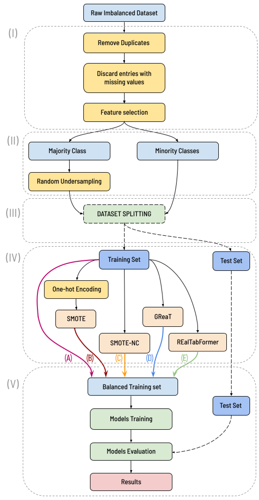
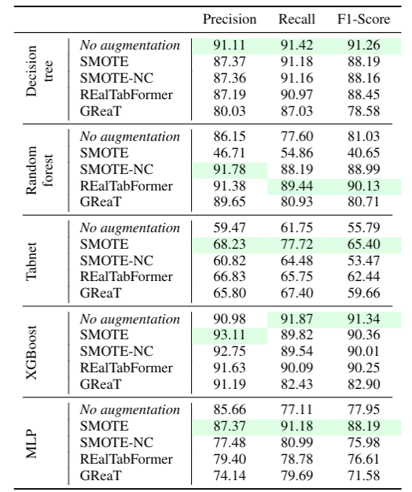

## GPT and Interpolation-based Data Augmentation for Multiclass Intrusion Detection in IIoT


<div align="center">

  [Article](https://ieeexplore.ieee.org/document/10418592) | [Dataset](https://www.kaggle.com/datasets/mohamedamineferrag/edgeiiotset-cyber-security-dataset-of-iot-iiot) 
 
</div>

### Description

The Industrial Internet of Things (IIoT) leverages interconnected devices for data collection, monitoring, and analysis in industrial processes. Despite its benefits, IIoT introduces cybersecurity vulnerabilities due to inadequate security protocols. This work focuses on intrusion detection in IIoT networks, addressing challenges of limited and imbalanced datasets.

Prior works have proposed Machine Learning (ML) for intrusion detection in IIoT, with ML models reliant on diverse and representative training data. Limited datasets and class imbalance hinder model generalization, emphasizing the need for data augmentation.

<div align="center">
  
  <p><em>Figure 1: Workflow with alternative scenarios for IIoT traffic data augmentation and classification evaluation.</em></p>
</div>

Data augmentation involves creating artificial data to address imbalances. In tabular data, methods like SMOTE generate synthetic samples. Recent works, such as [REalTabFormer](https://arxiv.org/abs/2302.02041) and [GReaT](https://arxiv.org/abs/2210.06280), explore GPT-based models for generating realistic tabular data.

This work evaluates the impact of data augmentation on intrusion detection in IIoT. We compare the performance of GPT-based methods with SMOTE and interpolation-based methods. We employ a dataset of IIoT traffic data, comparing model performance using different augmentation methods.

## TL;DR

The evaluation employs IIoT traffic data, in particular, the [EdgeIIoTset](https://www.kaggle.com/datasets/mohamedamineferrag/edgeiiotset-cyber-security-dataset-of-iot-iiot) dataset. The dataset contains up to 2 million records, representing 15 different classes of network attacks. 

Results reveal varied impacts on different algorithms. XGBoost exhibits a consistent response regardless of the application of data augmentation. Random Forest benefits, Tabnet exhibits somewhat uncertain behavior, and MLP improves with SMOTE augmentation. Further analysis indicate that GPT-based methods may generate out-of-distribution data, influencing the classification performance.

<div align="center">
    
    <p><em>Figure 2: Comparative Results of Multiclass Classification Performance Using Macro Average (%).</em></p>
</div>

This work underscores the nuanced impact of data augmentation on intrusion detection in IIoT. GPT-based methods introduce challenges, emphasizing the importance of systematic evaluation. Notably, XGBoost, a top-performing algorithm in this task, shows limited improvement with data augmentation. 

## Repository structure

<!-- colorfull struture -->
```
dataAugmentationTests/ 📁                  
├── notebooks/ 📓
│   ├── 1_data_analysis_<augmentation_method>.ipynb     📊: Data analysis
│   ├── 2_<augmentation_method>_augmentation.ipynb      🔄: Data augmentation
│   ├── 3_<augmentation_method>_evaluation.ipynb        📈: Evaluation
│   └── ...                       
├── src/ 📜
│   ├── utils.py           🛠️: Utility functions
│   └── ...                
├── results/📋
│   ├── metrics/           📝: Evaluation metrics CSV files
│   └── conf_matrix/       📉: Confusion matrix CSV files             
├── data/ 📂
├── old_repo/              🗄️: Previous repository backup
├── assets/                🖼️: Figures and logos
│
├── .gitignore 🚫
├── README.md              📖: Project README file
└── requirements.txt       📄: Dependencies

```

## To-do list

<!-- - [ ] Double-check the results folder -->
- [ ] Update requirements.txt

## Citation 

```bibtex
@ARTICLE{melicias2023gpt,
  author={Melícias, Francisco S. and Ribeiro, Tiago F. R. and Rabadão, Carlos and Santos, Leonel and Costa, Rogério Luís De C.},
  journal={IEEE Access}, 
  title={GPT and Interpolation-Based Data Augmentation for Multiclass Intrusion Detection in IIoT}, 
  year={2024},
  volume={12},
  number={},
  pages={17945-17965},
  keywords={Industrial Internet of Things;Data augmentation;Data models;Intrusion detection;Telecommunication traffic;Random forests;Classification algorithms;IIoT;cybersecurity;data augmentation;machine learning},
  doi={10.1109/ACCESS.2024.3360879}}

```

## Acknowledgements

This work is partially funded by FCT - Fundação para a Ciência e a Tecnologia, I.P., through projects UIDB/04524/2020, and under the Scientific Employment Stimulus - Institutional Call - CEECINST/00051/2018, and by ANI - Agência Nacional de Inovação, S.A., through project POCI-01-0247-FEDER-046083.


<hr style="height:0.5px; background-color:grey; border:none;">

<p align="center">

</p>

<hr style="height:0.5px; background-color:grey; border:none;">

<p align="center">

</p>

<hr style="height:0.5px; background-color:grey; border:none;">
